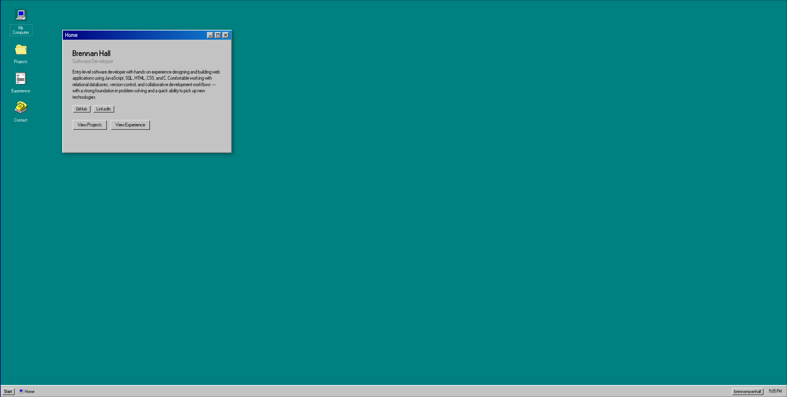

# Brennan Hall - Portfolio

**Demo video:** https://youtu.be/511xwNGpDXo

A full-stack portfolio built with React and Vite, styled as an interactive Windows 98 desktop. Icons, a taskbar, and a Start Menu open draggable, resizable, and minimizable windows for each section of the site, while the browser's URL stays in sync through client-side routing.

In phase 2, the Projects window moved off the GitHub API onto a custom Express + MongoDB API. Visitors can browse projects and, once logged in, like them. Admins can create, edit, and delete projects.



## Live Links
- **Frontend:** https://portfolio2026-ecru-omega.vercel.app
- **Backend API:** https://brh-portfolio-production.onrender.com

## Tech Stack
**Frontend**
- React + Vite
- react-router-dom
- react-rnd (window drag/resize)

**Backend**
- Node.js + Express
- MongoDB (Mongoose)
- JSON Web Tokens (`jsonwebtoken`) for authentication

**Deployment:** Vercel (frontend), Render (backend)

## Running Locally

```bash
git clone https://github.com/BrennanHall0918/portfolio2026.git
cd portfolio2026
npm install
cp .env.example .env
npm run seed
npm run dev
```

## API Routes

| Method | Path | Who can use it | Returns |
|---|---|---|---|
| POST | `/api/auth/register` | Public | Created user and/or JWT |
| POST | `/api/auth/login` | Public | JWT and user info |
| GET | `/api/projects` | Public | Array of projects |
| GET | `/api/projects/:id` | Public | A single project |
| POST | `/api/projects/:id/like` | Logged-in user (`requireAuth`) | Updated project / like count |
| POST | `/api/projects` | Admin (`requireAuth` + `requireRole("admin")`) | Created project |
| PUT | `/api/projects/:id` | Admin | Updated project |
| DELETE | `/api/projects/:id` | Admin | Deletion confirmation |

Unauthenticated or invalid-token requests to protected routes return `401 { "message": "Not authenticated" }`. Authenticated users without the required role get `403 { "message": "Forbidden" }`.

## Authentication
Protected routes use the `requireAuth` middleware. It reads a `Bearer` token from the `Authorization` header, verifies it with `JWT_SECRET`, then loads the user from MongoDB and checks that the account still exists, is active, and that the token's `tokenVersion` matches the user's current one. That makes it possible to revoke tokens before they expire. `requireRole(role)` runs after it and returns 403 if the user's role doesn't match.

## Architecture Overview (Frontend)

### Component Structure
```
src/
  components/
    Desktop.jsx          top-level layout
    Navbar.jsx           taskbar, Start Menu, clock
    DesktopIcons.jsx     desktop shortcuts
    Window.jsx           draggable/resizable window (react-rnd)
    WindowManager.jsx    maps open windows to their page components
    RouteWatcher.jsx     connects <Route> matches to window state
  hooks/
    useFetch.js          data/loading/error handling
  windows/
    Home.jsx
    Projects.jsx
    ProjectDetail.jsx
    Experience.jsx
    Contact.jsx
  styles/
    one CSS file per component, using shared CSS variables (global.css)
```

### Routing + Window State
The biggest architectural decision was mixing two things that don't normally coexist: URL-based routing (required for the assignment) and a desktop-style multi-window UI (where several "pages" can be open at once).

- `App.jsx` defines the real `<Routes>` tree. Each route's `element` is a `RouteWatcher`, not the actual page component.
- `RouteWatcher` calls `useParams()` (so `/projects/:id` resolves through React Router) and reports "this route matches" to `Desktop.jsx` via `DesktopSyncContext`.
- `Desktop.jsx` renders `<Outlet />` in a hidden container so these `RouteWatcher`s mount when their route matches. Nothing in that container is ever shown.
- The visible windows are rendered separately by `WindowManager`, driven by a `windows` array in `Desktop.jsx`'s state (position, size, z-index, minimized).
- Opening a window (via a desktop icon, taskbar button, or Start Menu item) calls `navigate()` to change the URL. The matching `RouteWatcher` then adds or focuses the corresponding window. The URL is always the source of truth: refreshing on `/projects` reopens the window, and links work correctly.
The hook guards against race conditions with an `isCancelled` flag in its `useEffect` cleanup, so a stale in-flight request can't overwrite fresher data or set state after unmount.

### Controlled Forms
`Contact.jsx` uses controlled inputs bound to a single `formValues` state object, with `handleInputChange` / `handleBlur` / `handleSubmit` naming. Validation (`validate()`) is a function of current state, recalculated each render. Errors only display once a field has been blurred (`touchedFields`), so the form doesn't show errors before the user has interacted with it. Submission is blocked both by disabling the submit button (`disabled={hasErrors}`) and by an early return in `handleSubmit` after `e.preventDefault()`.

### Styling Approach
All Windows 98 colors and bevel shadows are defined once as CSS custom properties in `global.css`, then reused across every component's stylesheet. The visual style stays consistent, and any adjustment only needs to happen in one place.

## Known Limitations
- The File Explorer-style toolbar's Back/Forward/Up buttons are purely decorative.